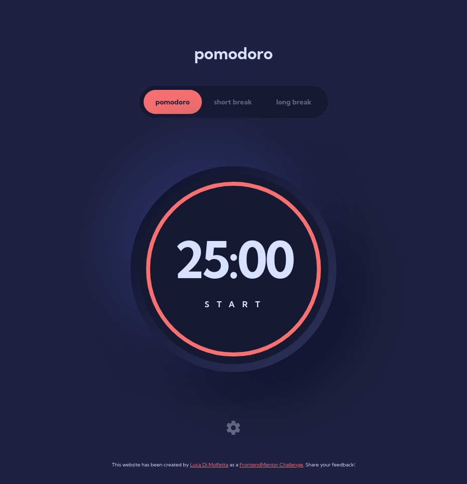

# Frontend Mentor - Pomodoro app solution

This is a solution to the [Pomodoro app challenge on Frontend Mentor](https://www.frontendmentor.io/challenges/pomodoro-app-KBFnycJ6G). Frontend Mentor challenges help you improve your coding skills by building realistic projects.

## Table of contents

- [Overview](#overview)
  - [The challenge](#the-challenge)
  - [Screenshot](#screenshot)
  - [Links](#links)
- [My process](#my-process)
  - [Built with](#built-with)
  - [What I learned](#what-i-learned)
  - [Continued development](#continued-development)
  - [Useful resources](#useful-resources)
- [Author](#author)

## Overview

### The challenge

Users should be able to:

- Set a pomodoro timer and short & long break timers
- Customize how long each timer runs for
- See a circular progress bar that updates every minute and represents how far through their timer they are
- Customize the appearance of the app with the ability to set preferences for colors and fonts

### Screenshot

### Links

- Solution URL: [Frontend Mentor](https://www.frontendmentor.io/solutions/pomodo-app-with-react-and-styled-components-kCq88IiDo-)
- Live Site URL: [Netlify](https://pomodoro-app-dimolf345.netlify.app/)

## My process

### Built with

- Semantic HTML5 markup
- Flexbox
- Mobile-first workflow
- [React](https://reactjs.org/) - JS library
- [Styled Components](https://styled-components.com/) - For styles
- React Testing library

### What I learned

I never developed a project writing tests. I wanted to learn the basic of TDD and testing in general. With this project I learn the basic of React Testing Library (RTL) philosophy and of Test Driven Development (TDD).

Moreover, This is my fourth project developed using React Library, and I focus my attention on component's architecture and state management.
Considering the simplicity of state in this kind of App, I opted for ContextAPI.

At the end, I wanted to expand my knowledge of Styled Components Library, so I used this project to learn how to use a globalStyles in the app, as well as styled-components with props and animation.

### Continued development

I want to learn how to write cleaner code with perfect reusable and testable components. This is not something you learn on tutorials, because often they are way simplier compared to real project. You can learn it only by doing.

### Useful resources

- [Simplify Testing with RTL](https://www.packtpub.com/product/simplify-testing-with-react-testing-library/9781800564459) - An amazing book that let you understand the basic of RTL with really useful example.
- [RTL crash course](https://www.youtube.com/watch?v=04BBgg8zgWo) - This is a free resource but it's an half of a paid course on udemy. I bought the full version because it really worth.

## Author

- Linkedin - [Luca Di Molfetta](https://www.linkedin.com/in/luca-di-molfetta-89659419a/)
- Frontend Mentor - [@dimolf345](https://www.frontendmentor.io/profile/dimolf345)
- Twitter - [@yourusername](https://www.twitter.com/yourusername)
